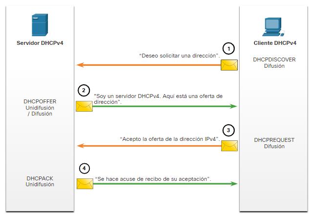
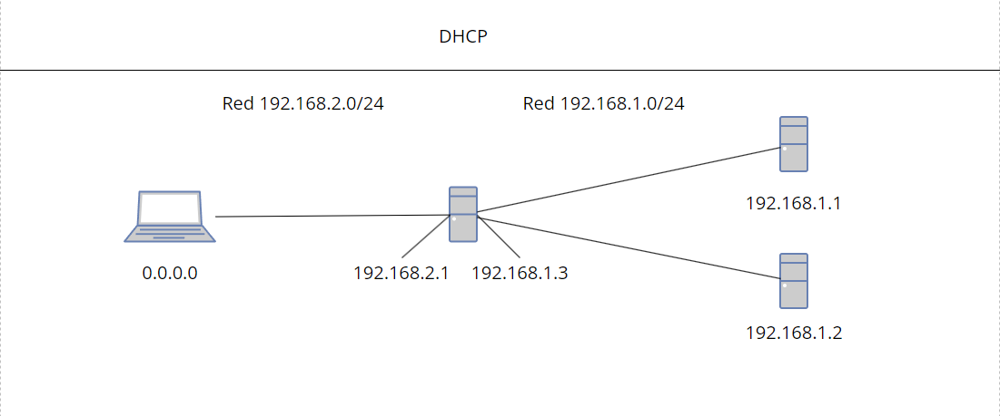

# DHCP server tutorial

El DHCP (Dynamic Host Configuration Protocol) es un protocolo de red que asigna automáticamente direcciones IP y otros parámetros de configuración a los dispositivos en una red. Esto simplifica la administración de la red, ya que evita la configuración manual de las IPs en cada dispositivo.

#### Funcionamiento del Protocolo DHCP:
- Descubrimiento (Discover): Cuando un dispositivo (cliente) se conecta a la red, envía un mensaje broadcast solicitando una dirección IP.
- Oferta (Offer): Un servidor DHCP recibe la solicitud y responde ofreciendo una dirección IP disponible, junto con otros parámetros como la puerta de enlace (gateway) y el DNS.
- Solicitud (Request): El cliente responde aceptando la oferta de IP propuesta por el servidor.
- Confirmación (ACK): El servidor confirma la asignación, reservando la IP para ese cliente por un tiempo determinado (lease).
#### Funcionamiento del Servidor DHCP:
- El servidor DHCP almacena un rango de direcciones IP disponibles para la asignación. Cuando recibe una solicitud de un cliente, selecciona una IP libre y la envía al cliente junto con otros parámetros de red
- El servidor también controla el tiempo durante el cual cada dirección IP está asignada (lease), lo que garantiza que las IPs se liberen cuando ya no se utilizan.

----------------------------------------------------------------------------------------------------------

### Tutorial de como hacer un servidor dhcp con relay y failover

Utilizaremos una red con 2 subredes una con la net 192.168.1.0/24 y otra con la net 192.168.2.0/24

### Coniguracion de servidor DHCP

Para Configurar este servidor utilizare un debian 12 en virtualbox y utilizaremos dos redes interna para hacer esta estructura de red. Pero primero tendremos que tener internet para descargar lo necesario para levantar el dhcp siendo este.
 - isc-dhcp-server ''' apt install isc-dhcp-server '''

*OMITIR EN CASOS REAL* Despues de instalar el paquete necesario para el servidor pondremos la red en modo red interna desde virtualbox.

Configuaremos el archivo "/etc/network/interface" para darle una ip statica y importante un enrutado hacia la red que necesitamos en mi caso 192.168.2.0/24

Reiniciamos la red para que nos actualize nuetra configuracion. 
- ''' $systemctl restart networking.service '''

Este servicio de por si solo no iniciara dara fallo por que hay que idicarle algunos parametros en dos archivos de coniguracion que son 
 - "/etc/default/isc-dhcp-server" En este archivo lo dejaremos con las lineas descomentadas igual que en la imagen y a;adiremos nuestro nombre de adaptador de red en la liena que pone "INTERFACESv4=". Os dejo el archivo -[a qui]()
      
 - "/etc/dhcp/dhcpd.conf" En este archivo es lo mas importante ya que en este pondremos como el servidor dhcp trabajara a si como las conseciones de ip que realizara os dejare como configuro el elachivo -[a qui]() y en la imagen.
    

Luego reiniciamos el servicio de dhcp con el comando.
 - ''' $systemctl restart isc-dhcp-server.service '''
Y ya deveria estar funcionado ahora mismo este servidor si le llegara una peticion discover ofreceria una ip.
