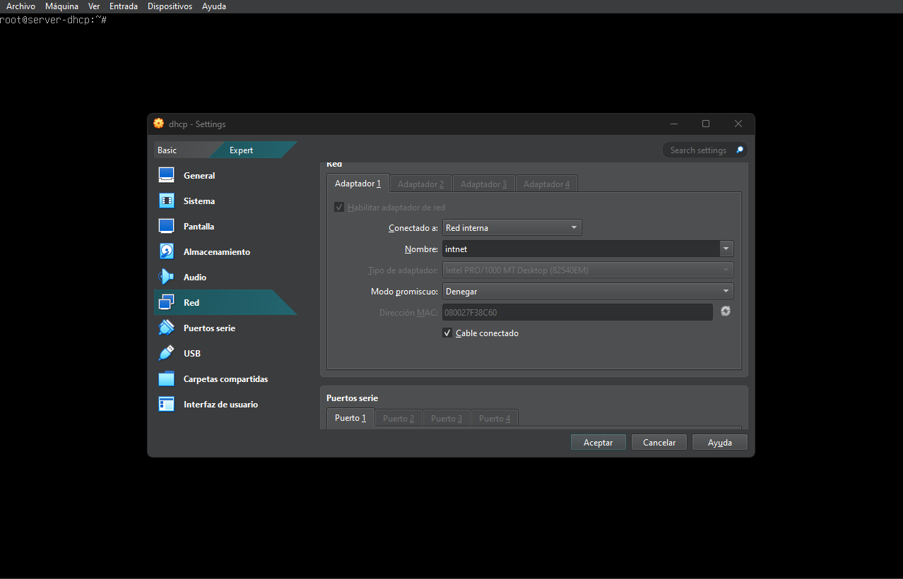
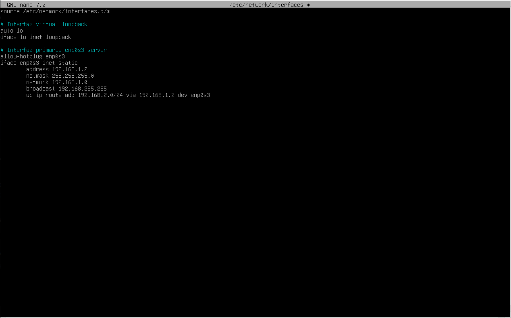
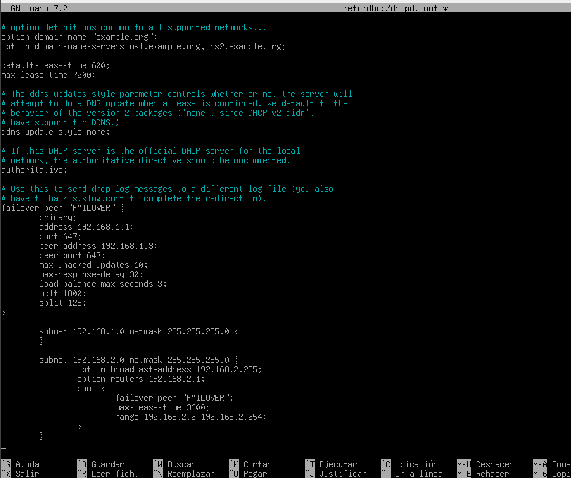
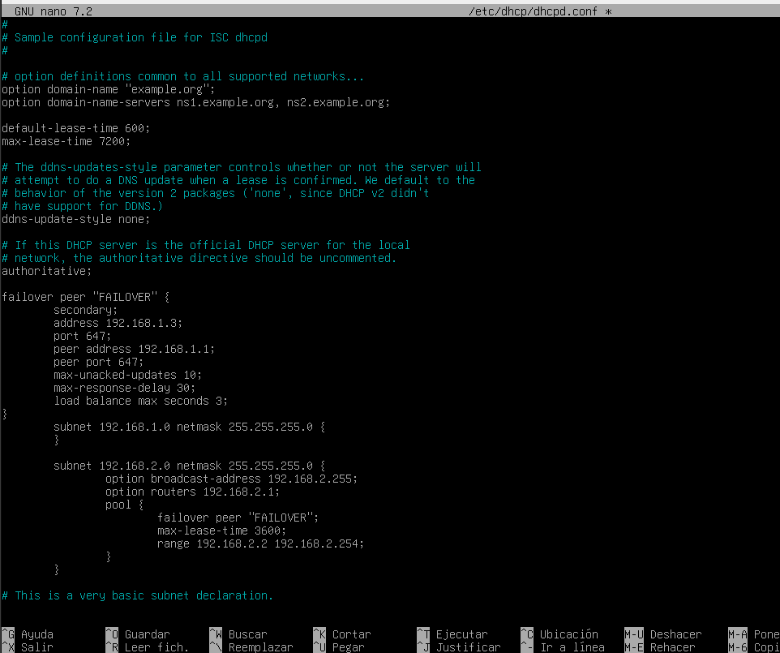

# Configuracion de servidor DHCP FAILOVER

Para configurar este servidor primero necesitamos ya creado un servidor DHCP, en mi caso sera el debian 12 que vemos en [configuracion-dhcp.md](./configuracion-dhcp.md) Una vez tengamos el DHCP principal procedemos a intalar lo necesario teniendo internet.

- Instalaremos el paquete "isc-dhcp-server" `$apt install isc-dhcp-server`

*OMITIR EN CASOS REAL* Una vez instalado cambiamos el adaptador a red interna con la red 192.168.1.0/24

- Configuramos el adaptador de red en statico con la ip 192.168.1.2 en el archivo "/etc/network/interface" y igual que en el DHCP normal tendremos qque poner una ruta paara llegar a la red 192.168.2.0/24

- Reiniciamos la red con `$systemctl restart networking.service`

Una vez todo instalado y con la red configurada podremos empezar a configurar nuestro failover. La configuracion es muy parecida al DHCP normal consolo que hay que poner un par de parametros mas.

- Empezaremos poniendo la configuracion del [DHCP primario](./configuracion-dhcp.md), en el archivo "/etc/dhcp/dhcpd.conf" podermos las siguientes opciones [*Guia oficial*](https://kb.isc.org/docs/isc-dhcp-44-manual-pages-dhcpd):

Ya teniendo el principal configurado hiremos al segundo que la configuracion es igual pero cambiando unos pocos parametros.

- Empezaremos modificando el archivo "/etc/default/isc-dhcp-server" descomentando las lineas necessarias y añadiendo el adaptador de red.

- Luego ya configuraremos el archivo "/etc/dhcp/dhcpd.conf" del DHCP failover, que es muy parecido solo cambian pocas lineas.

Como vemos en la catura solo cambian en la aprte del failover indicamos que es secondary; y cambiar la ip por el servidor principal y viceversa.

- Una vez todo configurado reiniciamos servicio con `$systemctl restart isc-dhcp-server.service`
