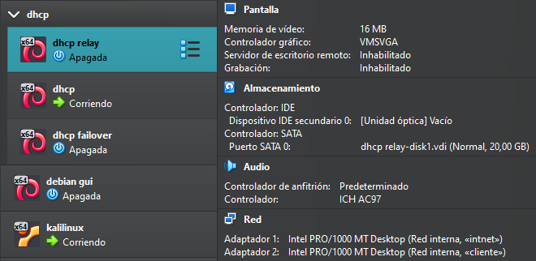
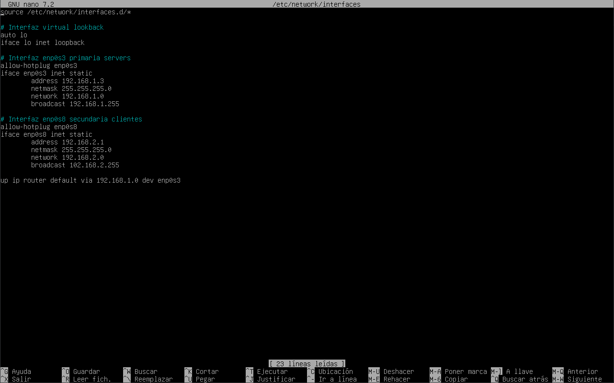
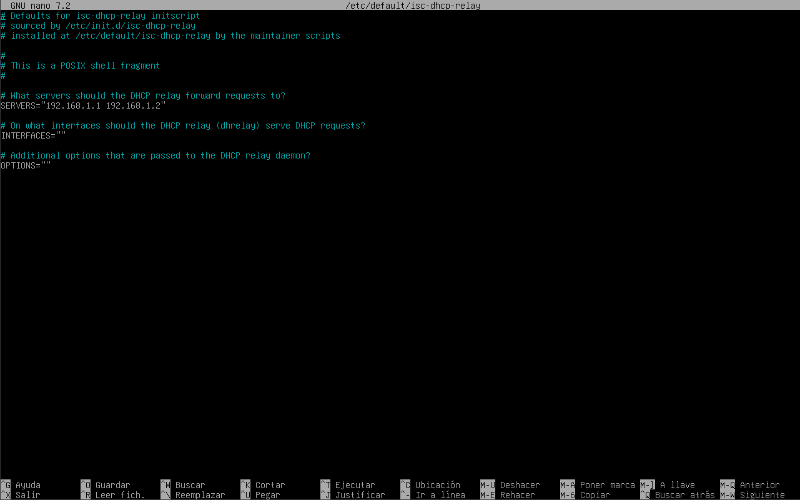

# Configuracion de relay

Para configuarar relay utilizaremos otra maquina debia y descargaremos el paquete

- isc-dhcp-relay `$apt install isc-dhcp-relay`
  

*OMITIR EN CASO REAL* haremos cambiaremos el adaptardor red interna y en este caso apagaremos la maquina para añadir otro adaptadro pero esta vez con otra red para el lado 
del cliente que esta red tendra la net 192.168.2.0/24, importante que el adpatador del cliente este en modo promiscuo

Luego procedemos a configurar la red desde el archivo "/etc/network/interface" en mi caso pongo como un enrutamiento para que todo vaya a la red de servidores 192.168.1.0/24

Reiniciamos la red para que se aplique con `$systemctl restar networking.service`

Una vez configurado las dos interfaces del relay con sus respectivas redes toca configurara el archivo "/etc/default/isc-dhcp-relay", donde tendremos que poner la ip de los servidores que escuchara nuestro realy, que seran los dos dhcp uno de ellos sinedo el de respaldo "Failover"

